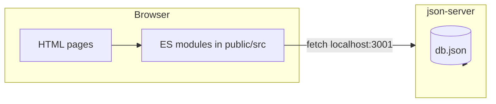

# DeskHub

DeskHub is a small **support ticket dashboard** for a capstone-style project. The UI is static HTML/CSS/vanilla ES modules; **json-server** provides a REST API over `db.json`.

**Live demo (GitHub Pages):**  
https://kalyan565.github.io/deskhub/public/index.html

> Screenshots: add `docs/screenshots/` with login, tickets list, detail, and dashboard when you hand this in.

## Features

- Login with persisted session (localStorage; demo users in `db.json`)
- Ticket list with search, filters, column sort, pagination
- Ticket detail: edit status, priority, assignee (PATCH + toast)
- Comments thread (aligned with `content` + `authorId` in `db.json`)
- Delete ticket with confirmation
- Create ticket modal with **field validation** (see [public/src/modules/form.js](public/src/modules/form.js))
- Dashboard: four stat cards + five most recent tickets

## Setup

1. **Install**

   ```bash
   npm install
   ```

2. **Run API + UI together**

   ```bash
   npm run dev
   ```

   - **UI:** `live-server` serves [public/](public/) at **http://127.0.0.1:8080** and opens **index.html**
   - **API:** `json-server` watches [db.json](db.json) at **http://localhost:3001**

3. **Or run separately**

   ```bash
   npm run api    # port 3001
   npm run serve  # port 8080, opens index
   ```

4. **Sign in (demo)**

   Use any user from `db.json`, for example:

   - `priya@deskhub.in` / `demo123`

## Architecture



- **Pages** live under [public/](public/) (`index.html`, `dashboard.html`, `tickets.html`, `ticket-detail.html`).
- **Modules:** `api/*` (HTTP), `modules/*` (UI logic), `utils/*` (storage, debounce, dates).
- **Auth:** client-only; token + user JSON in `localStorage`. There is no real auth server.

## Validation rules (create ticket)

Defined in [public/src/modules/form.js](public/src/modules/form.js):

| Field | Rules |
|--------|--------|
| title | Required, 5–100 characters |
| description | Required, min 10 characters |
| customerName | Required |
| customerEmail | Required, simple email format |
| priority | Required, one of `urgent`, `high`, `medium`, `low` |
| category | Required, one of `auth`, `billing`, `bug`, `feature` |

Inline errors update on **blur**; submit re-validates all fields; submit stays **disabled** until the form is valid.

## UI helpers

[public/src/modules/ui.js](public/src/modules/ui.js):

- **Toast** — auto-dismiss after ~3s  
- **Modal** — backdrop, **Escape**, click-outside to close (`openModal` / `closeModal`)  
- **confirmDialog** — async-friendly wrapper around `window.confirm` (used before delete)

## Known limitations

- Auth is **not** secure (passwords in `db.json`, token is a fake string).
- **CORS** is not an issue for local `127.0.0.1:8080` → `localhost:3001`, but hosting the UI and API on different origins in production would need CORS configuration.
- No automated tests in this repo.
- Comment `authorId` falls back to `1` if no user in storage (should not happen when detail page is protected by login).

## What I would add next

- Real backend auth (sessions/JWT) and hashed passwords  
- E2E tests (Playwright) for login → CRUD flow  
- Optimistic UI for PATCH instead of toast-only  
- Rich text or markdown for descriptions and comments  

## Project scripts

| Script | Purpose |
|--------|---------|
| `npm run dev` | `json-server` + `live-server` concurrently |
| `npm run api` | API only (`db.json`, port 3001) |
| `npm run serve` | Static UI only (port 8080) |
